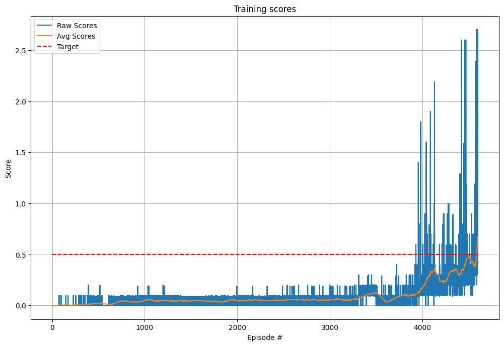

## Multi-Agent Deep Deterministic Policy Gradients (MADDPG) architecture

This repository is extracted from a project assignment of the Deep Reinforcement Learning course by Udacity.
An environment consisting of a two tennis table paddles is solved by mean of a Multi-Agent Deep Deterministic Policy Gradients (MADDPG) algorithm. 

The environment has a state space of 8 variables and an action space of 2 for each agent. The environment is considered solved when the average score of 100 consecutive runs is above 0.5 taking the maximum score collected among the agent on each episode

The DDPG agents are implemented with a parameter space noise that applies a normal white noise with zero mean to the parameters of the actor NN. The noise standard deviation introduced is adaptive and controlled with a feedback loop base on the measured distance on the action space of the perturbed and not perturbed actor. 

A target distance is set as hyperparameter as well as the initial noise standard deviation and the proportional coefficient of the feedback loop

The replay buffer is sampling the experience in randomized fashion.

In MADDPG implementation the actor of each agent is trained using the experience replay specific of each agent while the critic networks are using as input the states and actions of all agents.

The DNNs implemented for Critic and Actor are as follows:

- Actor DNN:
    - Input Layer: (24, 400) - Relu
    - First Hidden Layer: (400, 300) - Relu
    - Output Layer: (300, 4) - Tanh - the output is clipped to the range -1/+1

- Critic DNN:
    - Input Layer: (48, 400) - Layer Normalization - Relu
    - First Hidden Layer: (400, 300) - Layer Normalization - Relu
    - Action Layer (4,300) - Relu
    
    First and Action Layer are summed to obtain the Output Layer
    - Output Layer: (300, 1) - Linear 

## Hyper Parameter

The hyper parameters of the algorithm and their values are reported below:

- initial noise standard deviation = 1e-3
- target distance = 0.01
- coefficient of noise feedback loop = 1.05
- buffer size = int(1e6) 
- batch size = 512
- actor hidden dimension = (400,300)
- critic hidden dimension = (400,300)
- critic learning rate= 1e-4
- actor learning rate = 5e-4
- tau = 0.01
- gamma = 0.99      
- weight decay = 0
- update every # iteration = 1
- learn every # iteration = 1

## Results

The raw and averaged score recorded during traning are reported below.
The algorithm is capable of solving the environment in approximately 4600 episodes.

## Future improvements

The algorithm can be further improved by performing some in depth hyper parameters tuning

A further improvement could result from the use of a [Prioritized Experience Replay](https://arxiv.org/abs/1511.05952) in order to speed up the learning process that is substantially slow also when run on a GPU.

## References

- [CONTINUOUS CONTROL WITH DEEP REINFORCEMENT LEARNING](https://arxiv.org/abs/1509.02971) - Timothy P. Lillicrap,Jonathan J. Hunt,Alexander Pritzel,Nicolas Heess,Tom Erez,Yuval Tassa,David Silver & Daan Wierstra - Google Deepmind
- [Multi-Agent Actor-Critic for Mixed Cooperative-Competitive Environments](https://arxiv.org/abs/1706.02275) - Ryan Lowe, Yi Wu, Aviv Tamar, Jean Harb, Pieter Abbeel, Igor Mordatch
- DDPG implementation by [Phil Tabor](https://github.com/philtabor/Youtube-Code-Repository/tree/master/ReinforcementLearning/PolicyGradient/DDPG/pytorch/lunar-lander)
- [Parameter Space Noise](https://openai.com/blog/better-exploration-with-parameter-noise/) by OpenAI
- Parameter Space Noise implmentation by [Lianming Shi](https://github.com/l5shi/Multi-DDPG-with-parameter-noise)
